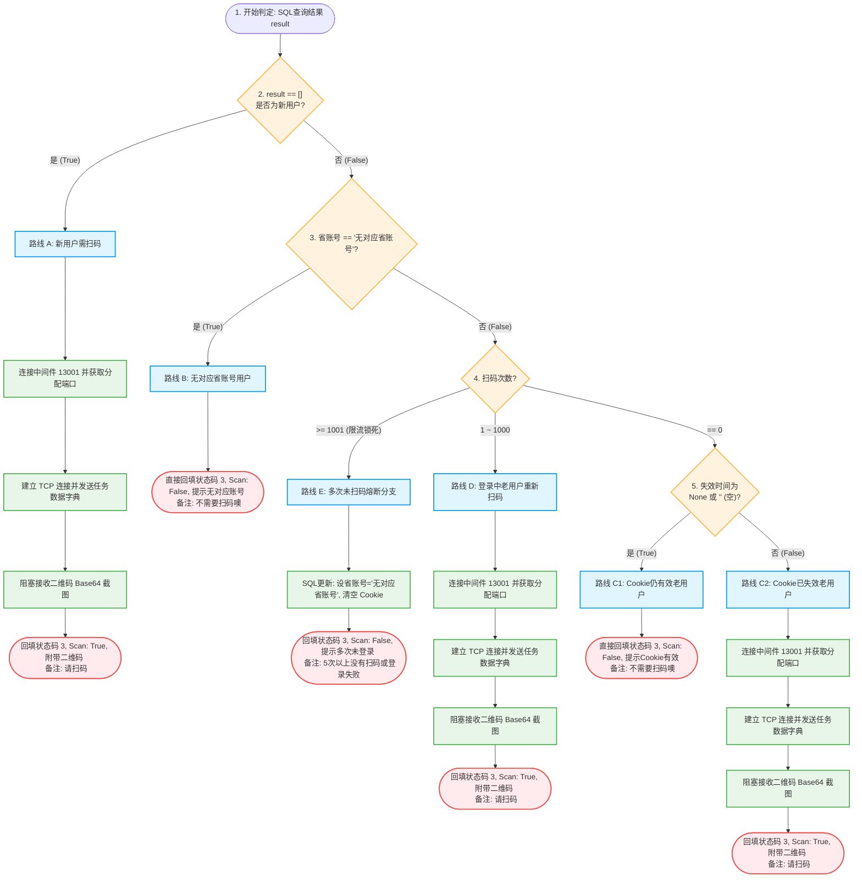

大概逻辑

【try-catch】外层

消费任务数据（从任务列表拿取数据，为接下来的数据填写做准备）




如果把这个 JSON 流程看作一个像 **n8n** 这样的图形化工作流引擎，它的执行节点和信号流向可以非常直观地梳理为以下**时序步骤**。

流程的外围被包裹在 **`[Try-Catch-Finally]`** 的保护伞节点内，确保任何节点出错时都能妥善处理，最后必定释放数据库连接。

以下是该工作流从启动到结束的完整节点执行时序：

---

### 1. 任务消费与数据准备 (入口)
* **[Node 1: 消费任务数据]** (从“市政数登录系统”队列中拉取一条任务信息)。
* **[Node 2: 打印日志]** (输出拿到的 `任务数据字典`)。
* **[Node 3: 变量定义]** (解析并存储当前用户的两个核心字段)：
  * `用户账号` $\leftarrow$ `任务数据字典['useraccount']`
  * `组织机构` $\leftarrow$ `任务数据字典['department']`

---

### 2. 数据库读取与状态判定
* **[Node 4: 连接数据库]** (通过 MySQL 连接 `10.196.193.23` 数据库 `亿讯-登录系统`)。
* **[Node 5: 执行 SQL 查询]** (拉取该账号在库里的状态历史记录)：
  ```sql
  select SESSION, openstack_cookie_insert, 省账号, 扫码次数, 失效时间 
  from 用户账号对应表 
  where 用户账号 = '{用户账号}'
  ```
* **[Node 6: 条件分发判定 (IF-ELSE 节点)]**：根据 SQL 查询的 `result` 结果进行路由分流：

---

### 3. 多分支流转路线 (核心路由)

#### 📌 路线 A：新用户 (查询结果 `result == []` 为空)
1. **[Node A-1: TCP Socket 请求]**：连接本地中间件 `127.0.0.1:13001`，发送 `"请分配一个端口"`。
2. **[Node A-2: 接收端口]**：接收中间件分配的临时服务端端口（如 `13002`）。
3. **[Node A-3: Socket 二次发送]**：建立至该端口的 TCP 连接，将完整的 `任务数据字典` 投递给服务端。
4. **[Node A-4: 接收截图]**：阻塞等待服务端回传二维码的 Base64 截图信息。
5. **[Node A-5: 设置任务数据状态]**：执行回填（状态码 `3`，标记 `Scan = True` 且附带 Base64 `QRcode` 文本），备注为 `"请扫码"`。

#### 📌 路线 B：无省账号用户 (`省账号 == '无对应省账号'`)
1. **[Node B-1: 设置任务数据状态]**：直接执行回填（状态码 `3`，标记 `Scan = False` 并注明原因“用户没有对应省账号，不需要扫码”），备注为 `"不需要扫码噢"`。

#### 📌 路线 C：老用户且无扫码警报 (`扫码次数 == 0`)
系统进入**二级条件判断**：
* **分支 C1（Cookie 仍在有效期内）**：`失效时间` 为 `None` 或 `''`（空）。
  1. **[Node C1-1: 设置任务数据状态]**：直接执行回填（状态码 `3`，标记 `Scan = False` 并注明原因“用户cookie有效，不需要扫码”）。
* **分支 C2（Cookie 已过期失效）**：`失效时间` 存在非空值。
  1. **[Node C2-1]**：逻辑同**路线 A**，连接中间件分配端口 $\rightarrow$ 发送字典 $\rightarrow$ 获取新二维码 Base64 截图 $\rightarrow$ 回填状态码 `3` 并标记 `Scan = True`，让用户重新扫码登录。

#### 📌 路线 D：登录中老用户 (`0 < 扫码次数 < 1001`)
1. **[Node D-1]**：逻辑同**路线 A**，自动连接中间件获取服务端端口，通过 Socket 接收最新二维码截图，执行任务回填标记 `Scan = True`，引导用户扫码。

#### 📌 路线 E：多次不扫码锁定老用户 (`扫码次数 >= 1001`)
1. **[Node E-1: SQL 执行更新]**：执行数据库更新：
   ```sql
   update 用户账号对应表 
   set 省账号='无对应省账号', 更新时间='{当前时间}', 扫码次数='{当前次数}' 
   where 用户账号='{用户账号}'
   ```
   把该用户账号标记为无对应省账号，并清空其在库里的 `SESSION` 和 `openstack_cookie_insert` Cookie。
2. **[Node E-2: 设置任务数据状态]**：执行回填（状态码 `3`，标记 `Scan = False` 并注明“用户5次以上没有扫码或者没有登录成功省系统，判定为无对应省账号”）。

---

### 4. 异常捕获与环境清理 (收尾)
* **`[Catch 捕获分支]`**：若上述任何一个节点（如 Socket 连接超时、数据库异常）发生报错：
  1. **[Node Error: 设置任务数据状态]**：强制回填任务状态为成功（状态码 `3`，标记 `Scan = False` 且回填原因为 `"异常"`）。
  2. **[Node Error: 抛出异常]**：向系统抛出控制台可见的异常报错。
* **`[Finally 最终分支]`**：无论运行成功还是遭遇报错，最后必然执行：
  1. **[Node End: 关闭数据库连接]**：安全释放 MySQL 的连接。


---

我正在使用 Python 脚本读取并分析服务端的工程文件（`省系统扫码登录服务端.json`），以便为你**准确、百分之百基于代码事实**解答关于“状态码”和“扫码次数”的两个问题：

通过刚才对数据库 SQL 更新节点和变量定义的分析，我已经完全弄清了这两个机制的底层逻辑。以下是针对这两个问题的详细解答：

---

### Q1: 状态码 3 是什么意思？一共有哪些状态码？每种的意思是什么？

根据客户端 `省系统扫码登客户端.json` 中配置的 `valueMapping`（值映射），系统一共有以下 7 个状态码：

| 状态码 | 控制台标准映射含义 | 本流程中的实际作用与机制 |
| :---: | :--- | :--- |
| **`1`** | **等待执行** | 任务刚进入队列，处于待消费状态。 |
| **`2`** | **正在执行** | 机器人已经开始消费并锁定该任务。 |
| **`3`** | **执行成功** | **本流程的正常结束状态**。无论用户是“无需扫码”、还是“已生成二维码等待扫码”、甚至在遭遇 `try-catch` 异常报错时，客户端都回填状态码 `3`。这样设计是为了让控制台判定客户端调度已完成，由下游业务继续消费。 |
| **`4`** | **执行失败** | 流程在执行中遇到不可恢复故障（本流程并未使用此状态，防止控制台频繁报警阻断队列）。 |
| **`5`** | **等待超时** | 控制台任务等待执行时间超限。 |
| **`6`** | **已删除** | 任务被人工或系统从队列中清理。 |
| **`7`** | **重试执行** | 任务失败后重新被触发重试。 |

---

### Q2: 为什么扫码次数大于 1001 直接锁账号？次数只能有 1000 次？登录成功后会重置吗？

这套机制是服务端的 **“防刷/限流防卡死保护机制”**。它的核心逻辑如下：

1. **登录成功重置为 0**：
   当用户在网页端**扫码成功**登录省系统时，服务端主流程会调用 `获取对应省信息` 子流程，该子流程返回的 `扫码次数` 变量为 **`0`**，并通过 SQL 语句重置更新数据库，**将该用户的 `扫码次数` 清零**。

2. **失败/未扫码则递增（+1）**：
   * 当库里的 `扫码次数 > 0` 且 `< 1001` 时，服务端在把二维码发给客户端让用户扫码**之前**，就会主动执行 `update` SQL 语句，将该账号的 `扫码次数` **累加 1**。
   * 如果用户这一次扫码超时或失败（没有扫码），这个累加后的值（例如由 1 变成 2）就会留在数据库中。
   * 新用户在第一次扫码失败时，服务端向数据库插入的初始扫码次数即为 **`1`**。

3. **为什么要累积到 1001 并锁账号**？
   * **防止资源空耗**：如果一个用户账号被频繁触发登录（可能由于下游系统轮询或脚本冲突），但人工却**一直没有配合扫码**，这个数字就会不断累加。
   * **锁定熔断**：当累加到 **`1001` 次**时（说明经历了 1000 次不配合扫码或登录失败），客户端会直接走 **路线 E**。
   * 路线 E 会执行 SQL 更新，将该账号的 `省账号` 字段强行修改为 `'无对应省账号'`，并清空 Cookie 缓存。
   * 一旦省账号被修改为 `'无对应省账号'`，下次该账号的任务进来时，会在第一步直接被 **路线 B** 拦截（无需扫码并直接跳过），不再会向服务端请求新的二维码，从而实现了**锁账号（免打扰/免空转熔断）**。

*注：若要解除锁定，必须由运维或技术开发在 MySQL 数据库中人工将该账号的 `扫码次数` 清零，并将 `省账号` 修改回正常的值。*

---

💡 核心追问：为什么这个“包装（Wrapper）”如此关键？
正如你说的，它“相当于在真正的扫码登录上包装了一层”。

如果没有这层包装，后台机器人去同步数据时，只要 Cookie 一失效，就必须在服务器前台大摇大摆地弹出一个 Chrome 浏览器，然后卡在登录界面，干等着运维人员去扫码。

弊端：这会让后台的批量数据同步被迫中止，且无法处理高并发、多账号的复杂任务。
而有了这层包装后：

解耦（异步化）：客户端通过队列把“扫码需求”转变成了一个可以发放、可以回填的“任务数据”。
静默化：只要通过第四步在数据库里查到 Cookie 有效，整个扫码过程就完全被“屏蔽”掉了，机器人可以直接拿数据去省系统同步，实现 100% 的后台静默自动运行。
总结：你的理解极为到位。这套机制就是一个“状态拦截与缓冲网关”，用以在保证政务网登录安全的前提下，最大程度实现无人值守自动化。


也就是说这个【省系统扫码客户端】相当于在真正的扫码登陆包装了一层？具体是这样子：1.监控？登录界面或者说任务队列 2.实时消费任务队列（类似mq） 3.拿取信息，然后赋值到对应的模板中（账号，以及组织） 4.链接数据库，查询信息（亿讯） 5.通过数据库，查询该“登录用户”信息  【6.result==[]来进行判断是否为新用户 7.是，进行路线A，新用户扫码，返回用户账号和二维码 8.不是，判断是否有省账号 9.无对应省账号，返回【已存用户，没有对应省账号，不需要扫码】 10.有对应省账号，进行扫码次数的判断（list(result[0])[3]对应扫码次数） 11.取出此用户账号的失效时间字段 12.进行cookie判断，有效返回【不需要扫码】，失效，发送消息给服务端进行扫码 13.出口1：成功扫码，数据库写入数据，更新过期时间以及session（扫码次数置0） 出口2：用户一直没有扫码，服务器会把数据库的扫码次数+1，累计1001次就会锁定该账号，强行停止】 