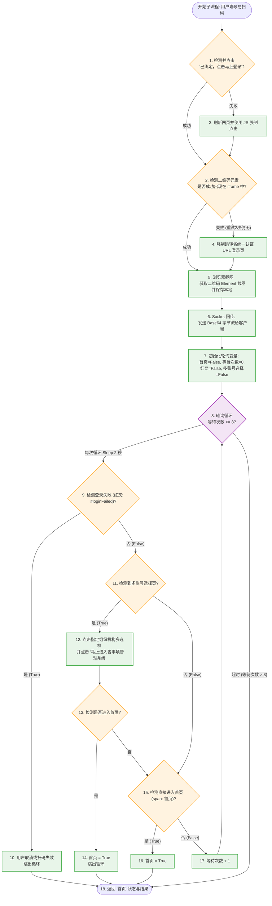

# 用户粤政易扫码-核心业务逻辑与流程拆解

> - **本篇重点**：聚焦于服务端子流程 `用户粤政易扫码` 的执行细节，阐明浏览器控制、截图回传与扫码轮询检测的流转机制。

---

## 1. 文字描述的扫码流程执行过程

整个【用户粤政易扫码】子流程作为服务端的网页控制核心，主要负责打开前台网页、截取二维码图片回传给客户端，并持续监控用户的手机扫码状态。具体运行步骤如下：

### 第一阶段：浏览器跳转与登录准备
1. **点击已有绑定登录**：在已打开的省系统管理页面上，检测是否存在并尝试点击 `"已绑定，点击马上登录"` 按钮（Block 1 ~ Block 2）。
2. **失败兜底与刷新**：如果首次点击失败，则自动刷新页面，并使用 JavaScript 脚本强制点击该登录按钮（Block 3 ~ Block 5）。
3. **确认二维码容器加载**：检测 iframe 内的二维码图片元素 `//img[contains(@class,'qrcode lightBorder')]` 是否渲染成功（Block 9 ~ Block 10）。
4. **强行跳转认证 URL**：如果二维码未能成功加载，在 2 次重试内，流程会直接调用 `Browser.navigateURL` 强行跳转至省统一身份认证平台的登录地址（Block 11 ~ Block 18）。

### 第二阶段：截图与 Socket 传输
5. **截取二维码图片**：流程定位到 iframe 中的二维码图片元素，执行浏览器截图（Block 36 ~ Block 38），获取 Base64 图片大文本，并将其同步保存到运行服务器的本地磁盘中（如 `"C:\Users\ADMIN\Desktop\粤政易截图\"`）。
6. **Socket 字节流回传**：执行内置 Python 代码块，将大文本经过 UTF-8 编码，通过已建立的 TCP 链路 `conn_socket.sendall` 灌回给等待的客户端（Block 42）。

### 第三阶段：多终态扫码状态轮询（关键闭环）
7. **初始化判定变量**：定义轮询控制标志：`首页 = False`，`等待次数 = 0`，`红叉 = False`，`多账号选择 = False`（Block 43 ~ Block 46）。
8. **开启 16 秒轮询窗口**：进入常驻循环（Block 47），每次循环延迟 2 秒（最大等待次数 8 次，即约 16 秒的扫码等待期）。
9. **分支 A：检测到红叉失败（Block 49 ~ Block 53）**：
   * 检测页面上是否显示 `//*[@id='loginFailed']` 元素。
   * 若显示，说明扫码失效或过期，更新 `红叉 = True` 并跳出循环。
10. **分支 B：检测到多组织/账号选择（Block 54 ~ Block 62）**：
    * 检测页面上是否出现 `//div[text()='选择要登录的省事项管理系统账号']` 容器。
    * 若出现，判定为多账号绑定。机器人自动定位到参数中指定的 `组织机构` 对应的输入多选框 `//span[text()='%s']/parent::td/preceding-sibling::td[3]/input` 进行点击。
    * 接着点击 `"马上进入省事项管理系统"` 按钮提交。
    * 重新检测是否成功进入 `"首页"`，若进入则更新 `首页 = True` 并跳出循环。
11. **分支 C：检测到直接进入首页（Block 63）**：
    * 检测页面是否展现菜单标题元素 `//span[text()='首页']`。若有，更新 `首页 = True`，循环由于 `首页` 变为 `True` 而在下一次执行时自动终止。
12. **累计轮询次数**：如果上述均未检测到，则执行 `等待次数 = 等待次数 + 1`（Block 64）继续下一轮 2 秒等待，直至超时退出。

### 第四阶段：状态返回
13. **结果回传与状态回填**：流程将最终的 `首页` 变量（True/False）返回给服务端主流程（Block 67），同时客户端也会同步接收到该任务的执行结果。

---

## 2. 扫码子流程图 (Mermaid)

