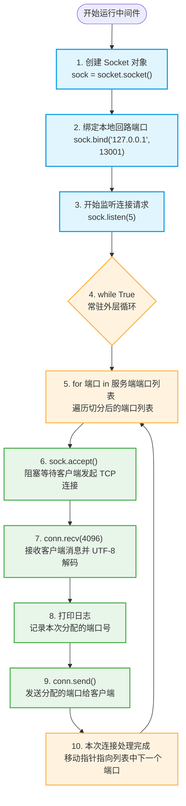

# 省系统扫码登录中间件 - 流程图

以下是中间件在 `127.0.0.1:13001` 上监听并轮询分发服务端端口的 Mermaid 流程图：

---

1.用于给客户端可用的服务端接口 2.给与之后就会断开 3.断开之后会继续检测端口列表 4.分配的端口池通过【for 端口 in 服务端端口列表.replace('，',',').replace(' ','').split(',')】进行切割得到【'13002','13003'】 5.轮询分配端口 

