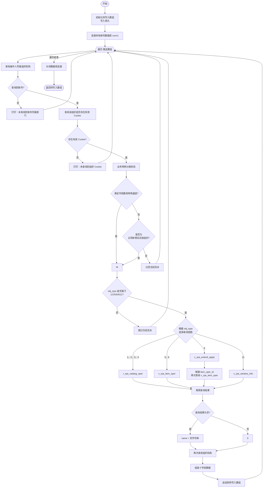

# 生成数组与导出子流程-核心业务理解与流程拆解

> - **本篇重点**：聚焦于数据清洗转换子流程 `生成数组` 与 Excel 备份子流程 `写入excel` 的执行细节，阐明其多库联合检索、数据清洗校验规则、事项名称多级视图转换以及 Excel 区域持久化落地的底层逻辑。

---

## 1. 为什么需要这些子流程？（设计意图与架构定位）

这两个流程承载了事项分发前的**数据加工与本地归档（Data Processing & Archiving）**职责：

* **`生成数组.json`（数据清洗核心）**：市系统中的原始推送流水只有操作人账号和操作对象 ID。机器人需要在正式同步前，把这些零散、无业务语义的流水转化为结构化的“可处理事项清单”。它通过联合查询本地库与事项配置库，为每条流水补全其归属的“组织机构”和“事项名称”，并根据极细致的政务过滤逻辑筛选掉不合格的脏数据。
* **`写入excel.json`（本地历史备份 - 当前禁用）**：在清洗完成并分组投递前，将本次待处理的二维事项矩阵一次性导出到本地磁盘。其设计初衷是作为系统运行的物理审计凭证，供运维人员对每日的转录工作进行对比留痕。

---

## 2. 文字描述的 `生成数组` 流程执行过程

整个【生成数组】子流程负责建立底层映射，具体流转与逻辑规则如下：

### 第一阶段：初始化与本地账号库连接
1. **定义数组与表头**：初始化定义空的 Python 列表 `待写入数组`。并在首行插入包含十个字段的属性表头：
   `['市系统id', '对象obj_id', '事项名称', '转录状态', '错误原因', '操作对象', '操作类型', '组织机构', '创建时间', '更新时间']`。
2. **连接账号数据库**：机器人使用内置数据库组件连接至本地 MySQL `conn1`（主机 `10.196.193.23` 端口 `3306`，用户名 `root`，密码 `"Sd_12345"`，数据库 `亿讯-登录系统`）。

### 第二阶段：遍历流水与多层安全拦截校验
3. **遍历原始推送流水**：流程开始遍历主流程传入的 `推送数组`（每一个条目为一条流水 `字典`），执行以下过滤拦截：
4. **校验一：账号所属机构存在性校验**：
   * 使用当前记录的操作人 `字典["oper_user_name"]` 在本地库中查询归属机构：
     ```sql
     select * from 用户账号对应表 where 用户账号 = '{操作人账号}' limit 1;
     ```
   * **拦截逻辑**：如果未能从库里检索到此账号的记录，直接打印“未查询到账号所属部门”并执行 `Control.continue` 抛弃本条流水。
5. **校验二：有效登录 Cookie 校验**：
   * 用检索到的 `组织机构` 作为条件，查询该机构当前是否有在有效期内的 Cookie 凭证（SESSION 非空且不包含“失效”）：
     ```sql
     select * from 用户账号对应表 
     where 组织机构 = '{组织机构}' and SESSION is not null and SESSION not like '%失效%' and SESSION != '' limit 1;
     ```
   * **拦截逻辑**：如果该组织在库里没有任何可用的 Cookie 凭证，则打印“未查询到组织cookie”并跳过此记录。
6. **校验三：业务特例分类校验**：
   * **特例 1（市政数局特殊通道）**：根据流水中的对象 ID `obj_id` 查询原始事项表 `r_rpa_catalog_oper`。若满足：该事项在目录库中存在、或主系统同步标识为 '0'（无需省系统同步）、或目录层级为 '4'（区级主项子项政策兑现等业务）。则打印“区主项子项政策兑现公共服务类直接用市政数局账号同步”，直接跳过后续的普通单位筛选，放行进入待写数组。
   * **特例 2（常规主项新增过滤）**：如果数据不属于“操作对象为 1（主项）、操作类型为 0（新增）且操作人组织机构包含‘区’字”的组合，流程会执行 `Control.continue` 将其抛弃。

### 第三阶段：多视图关联转换“事项名称”
7. **校验操作对象类型**：检查流水的 `obj_type` 字段是否在 `['1','2','5','6','9','11']` 范围中，若不在则直接跳过该流水。
8. **跨视图检索事项名（name）**：根据 `obj_type` 属性，选择对应的数据库视图查询具体事项名称：
   * **主项/子项等基础目录（`1, 2, 3, 4`）**：查询 `r_rpa_catalog_oper` 目录操作表取得名称：
     ```sql
     SELECT * FROM r_rpa_catalog_oper WHERE id = '{obj_id}'
     ```
   * **实施清单类业务（`5, 6`）**：查询 `v_rpa_item_oper` 事项操作表取得名称：
     ```sql
     SELECT * FROM v_rpa_item_oper WHERE id = '{obj_id}'
     ```
   * **延伸审批业务（`9`）**：首先查询延伸表 `v_rpa_extend_apply`：
     ```sql
     Select * from v_rpa_extend_apply where id='{obj_id}'
     ```
     如果检索到数据，再反查事项操作表获取真实的事项名称：
     ```sql
     Select * from v_rpa_item_oper where id ='{延申数据[0]["item_oper_id"]}'
     ```
   * **窗口人员/配置信息（`11`）**：查询窗口视图 `v_rpa_window_info` 获取名称：
     ```sql
     Select * from v_rpa_window_info where id = '{obj_id}'
     ```
9. **降维防空值处理**：将查询结果转化为列表。若列表为空则将事项名称置为 `""`，否则读取 `result[0]['name']` 赋予变量 `name`。

### 第四阶段：数组拼装与数据返回
10. **获取最终组织机构**：再次在本地库中为该条流水关联查询并补全 `组织机构` 字段。
11. **向矩阵追加清洗行**：将包含市系统ID、对象ID、解析得到的事项名称、转录状态、错误原因、操作对象、操作类型、组织机构、创建时间、更新时间的十元组数据追加到 `待写入数组` 尾部。
12. **关闭连接并返回**：循环遍历结束后，关闭本地 MySQL 连接，将完整的 `待写入数组` 列表通过 `Control.return` 回传给主流程。

---

## 3. 文字描述的 `写入excel` 流程执行过程

虽然该子流程在主控制节点中处于**禁用状态**（`is_enable: False`），但其代码事实层面的逻辑步骤如下：

1. **工作簿创建**：调用 Excel 接口，在服务器后台安静创建（新建）一个 Excel 工作簿对象（`Excel.newExcel`），并获取默认打开的第一个工作表 `Sheet1`。
2. **表头行物理写入**：定义局部表头数组 `表头`，在工作表首行 **A1** 单元格横向写入。
3. **成片区域数据写入**：以 **A2** 单元格作为起始坐标，调用 Excel 区域写入接口，将主流程传入的 `二维数组` 一次性成片写满工作表（Block 5）。
4. **物理落地另存为**：调用另存为组件，把这套数据以 Excel 格式物理持久化输出到服务器的指定路径下：
   `"D:\二次录入并发运行\二次录入.xlsx"`
5. **不保存关闭**：关闭 Excel 工作簿并强制释放 Excel 进程内存，以防在服务器后台产生无用句柄。


---
