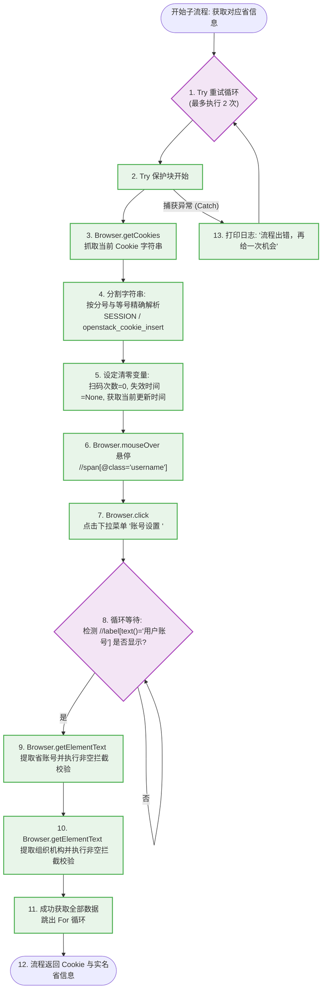

# 获取对应省信息子流程-核心业务逻辑与流程拆解

> - **本篇重点**：聚焦于服务端核心子流程 `获取对应省信息` 的执行细节，阐明登录成功后 Cookie 的分割提取算法、悬停进入账号设置页以及爬取省账号/组织机构的业务流程。

---

## 1. 为什么需要这个子流程？（设计意图与架构定位）

本流程是扫码登录成功后的“**收尾与数据提取关卡**”。当主流程判定用户已成功扫码进入系统首页时，会立即调用本流程：

* **Cookie 收割者**：负责抓取当前 Chrome 浏览器中最新、最权威的会话 Cookie，并进行精确分割提取，为写入数据库提供新鲜的凭证。
* **物理账号解密**：省系统的 Session Cookie 仅代表登录凭证，机器人为了后续能匹配到具体的人，必须进入系统后台的“账号设置”页面，把用户的“省账号”和“组织机构”这二个实名属性爬取下来，用于数据库映射。

---

## 2. 文字描述的流程执行过程

整个【获取对应省信息】子流程采用双重尝试保护机制。具体运行步骤如下：

### 第一阶段：Cookie 获取与字符串分割
1. **双重重试循环**：开启一个最大次数为 2 次的 For 循环（Block 1），并将整个核心提取逻辑包裹在 `Try-Catch` 保护块中（Block 2）。如果首次执行遭遇网页卡顿等异常，会自动触发第二次重试机会（Block 43 ~ Block 45）。
2. **抓取浏览器 Cookie**：调用 `Browser.getCookies` 抓取 Chrome 浏览器中当前的 Cookie 键值对字符串（Block 4）。
3. **分步执行字符串切割**：
   * **按分号（`;`）分割**：将抓取到的 Cookie 字符串按照分号切分成数组（Block 6）。
   * **提取第一对参数**：将第一组 `name=value` 取出，按照等号（`=`）分割，提取出 **`openstack_cookie_insert`** 的具体值（Block 10 ~ Block 13）。
   * **提取第二对参数**：将第二组 `name=value` 取出，按照等号（`=`）分割，提取出 **`SESSION`** 的具体值（Block 11 ~ Block 15）。
4. **生成状态回写变量**：
   * 获取当前最新的系统时间，格式化为 `%Y-%m-%d %H:%M:%S`（更新时间）。
   * 初始化定义 **`扫码次数 = 0`**（一旦走到这，说明用户已扫码成功，次数必须清零）。
   * 初始化定义 **`失效时间` 为空**（Cookie 已经更新，旧的失效标记清空，以便后续客户端能够静默登录）。

### 第二阶段：后台页面跳转与属性抓取
5. **触发悬停下拉菜单**：使用鼠标悬停组件（`Browser.mouseOver`），将鼠标指针放到页面右上角的用户名 `//span[@class='username']` 上，触发系统设置下拉菜单展现（Block 21）。
6. **点击进入账号设置**：模拟鼠标点击下拉菜单中的 `"账号设置 "` 链接按钮（Block 22）。
7. **阻塞等待页面加载**：延迟 2 秒后，进入 `while` 条件循环，检测页面上的 `"用户账号"` 标签 `//label[text()='用户账号']` 是否渲染展现，直到加载成功才放行（Block 24 ~ Block 29）。
8. **提取并校验省账号**：
   * 调用 `Browser.getElementText` 获取 `//label[text()='用户账号']/../div/p` 节点的文本内容，存入变量 `省账号`（Block 30）。
   * 使用 `while 省账号 == ''` 循环进行空值拦截校验，确保必须拿到有效的非空字符串后，才允许向后执行（Block 31 ~ Block 34）。
9. **提取并校验组织机构**：
   * 同理，调用 `Browser.getElementText` 获取组织机构节点 `//label[text()='组织机构']/../div/p` 节点的文本内容，存入变量 `组织机构`（Block 36）。
   * 采用 `while 组织机构 == ''` 进行空值拦截校验，确保提取到真实的组织名（Block 37 ~ Block 40）。
10. **成功跳出并返回**：
    * 成功获取到两组字段后，执行 `Control.break` 破出外层 For 重试循环（Block 42）。
    * 调用 `Control.return` 将提取到的 `SESSION`、`openstack_cookie_insert`、`扫码次数`（为 0）、`失效时间`（为空）、`更新时间`、`省账号` 和 `组织机构` 变量返回给主调度流程（Block 50）。

---

## 3. 提取省信息流程图 (Mermaid)

